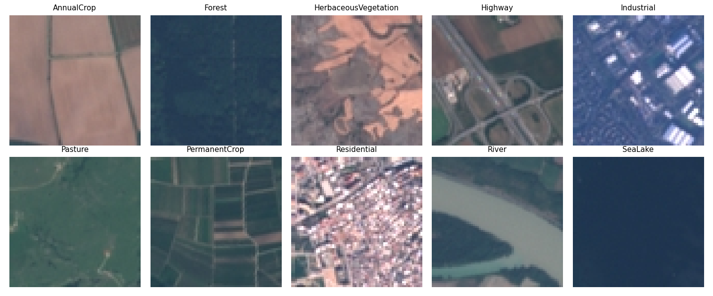
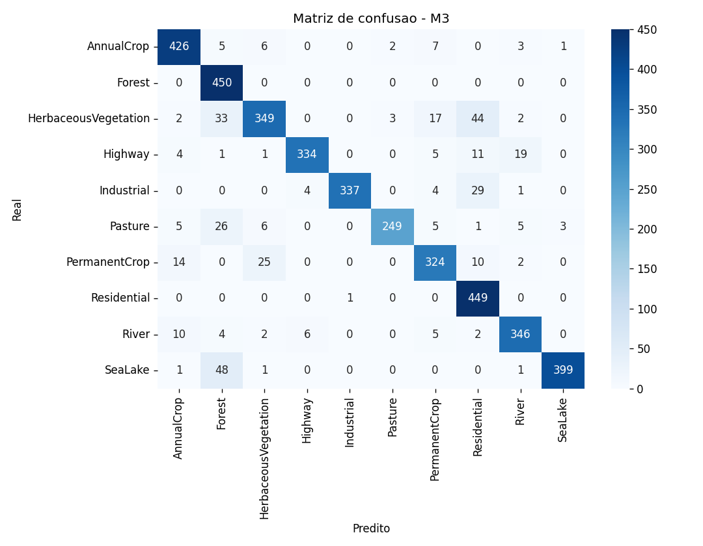
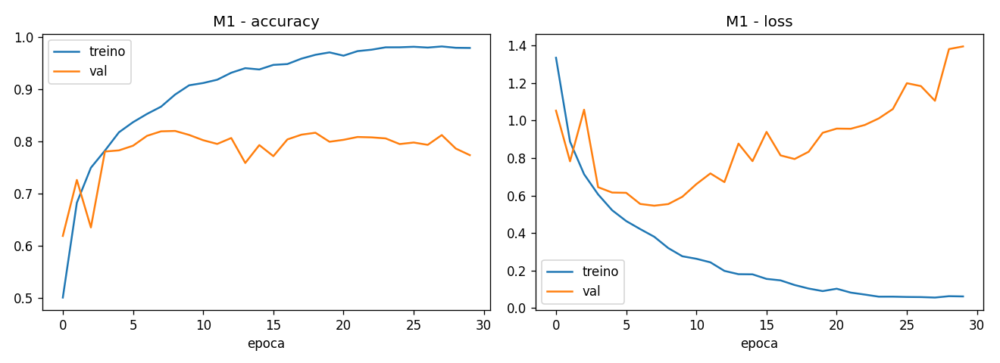
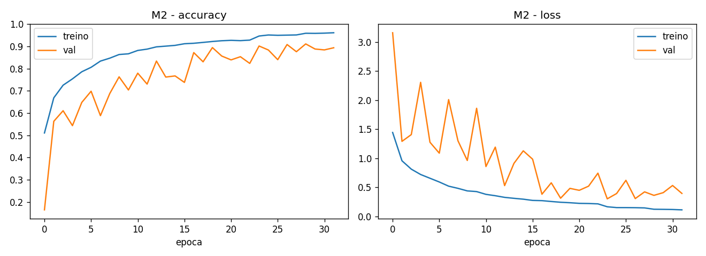
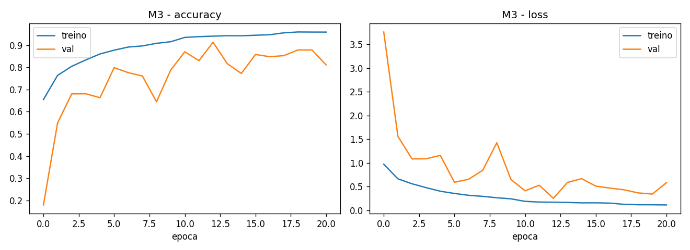

<div align="center">

# 🛰️ EuroSAT Land Cover — CNNs do Zero

### Classificação de cobertura do solo a partir de imagens de satélite Sentinel-2

**Global Solution 2026/1 · Applied Computer Vision · FIAP**
Grupo **TPGN** — TechPulse GlobalNetwork

<br>


</div>

---

> **TL;DR** — Três redes neurais convolucionais **treinadas do zero** (sem transfer learning)
> classificam tiles Sentinel-2 em **10 classes de cobertura do solo**. Comparamos as arquiteturas,
> ultrapassamos a meta de **88%** de acurácia e servimos o melhor modelo numa **demo web** (FastAPI).

---

## 🌍 Contexto & Indústria Espacial

A nova corrida espacial é movida por **software**. Constelações como a Sentinel-2 (programa
Copernicus / ESA) geram um fluxo contínuo de imagens da Terra — mas o dado orbital cru só vira
valor quando um sistema sabe interpretá-lo.

Este módulo é a **camada de Visão Computacional** da solução integrada do TPGN: uma plataforma de
**dados de precisão para agricultura e cidades**. Convertemos pixel de satélite em rótulo
acionável — *quanto de plantação, floresta, área construída ou água existe numa região* —
habilitando decisões de uso do solo, monitoramento agrícola e planejamento urbano.

<div align="center">

🎯 **ODS 2** Agricultura sustentável · 🏗️ **ODS 9** Inovação e infraestrutura · 🏙️ **ODS 11** Cidades inteligentes

</div>

---

## 👥 Equipe TPGN

| Integrante | RM |
|:--|:--:|
| **Guilherme Rocha Bianchini** | RM97974 |
| **Nikolas Rodrigues Moura dos Santos** | RM551566 |
| **Pedro Henrique Pedrosa Tavares** | RM97877 |
| **Rodrigo Brasileiro** | RM98952 |
| **Thiago Jardim de Oliveira** | RM551624 |

---

## 🎥 Vídeo de Apresentação

<div align="center">

### ▶️ **[ASSISTIR NO YOUTUBE — preencher após gravar]**

*(demonstração da proposta + funcionamento do sistema, ≤ 3 min)*

</div>

---

## 📊 Dataset — EuroSAT (RGB)

<table>
<tr><td>

- **Fonte:** EuroSAT (Helber et al.) — tiles **Sentinel-2**
- **Volume:** 27.000 imagens · 64×64 px · 10 classes
- **Carregamento:** `tensorflow_datasets` (`eurosat/rgb`)
- **Split estratificado** (criado pela equipe): **70 / 15 / 15**
- **Pré-proc.:** normalização `[0,1]` (camada `Rescaling`) + data augmentation

</td><td>

**Classes**
`AnnualCrop` · `Forest` · `HerbaceousVegetation`
`Highway` · `Industrial` · `Pasture`
`PermanentCrop` · `Residential` · `River` · `SeaLake`

</td></tr>
</table>



---

## 🧠 Arquiteturas — 3 CNNs do Zero

Cada modelo isola **uma variável arquitetural**, permitindo uma comparação tecnicamente justificada.

| Modelo | Arquitetura | O que isola | Esperado |
|:--|:--|:--|:--:|
| 🟦 **M1 — Baseline** | 2× (Conv → MaxPool) → Flatten → Dense(128) | piso de referência (overfitting) | ~80–85% |
| 🟩 **M2 — Deep + Reg** | 4 blocos [Conv-BN-ReLU×2 → Pool → Dropout] + augmentation + Dense(256) | profundidade + regularização | **~90–95%** |
| 🟨 **M3 — GAP** | backbone do M2 com **GlobalAveragePooling** no lugar de Flatten+Dense | papel da cabeça densa / nº de params | ~89–93% |

> 🚫 **Sem modelos pré-treinados. Sem transfer learning.** Tudo implementado do zero em Keras.

---

## 📈 Resultados

| Modelo | Parâmetros | Acurácia (teste) | Loss (teste) |
|:--|:--:|:--:|:--:|
| 🟦 M1 — Baseline | 2.117.962 | 76,54% | 1,4186 |
| 🟩 M2 — Deep + Reg | 1.111.402 | 89,60% | 0,3371 |
| 🟨 **M3 — GAP** | **585.578** | **90,44%** | **0,2853** |

<div align="center">

🏆 **Melhor modelo: M3 (GAP)** — **90,44%** no teste ✅ (meta ≥ 88%)
*com o **menor** número de parâmetros: ¼ do M1 e metade do M2.*

</div>

**Leitura técnica:** o **M1** decora o treino (acurácia de treino ~0,98 vs. validação ~0,80, com o
loss de validação subindo) — overfitting clássico. O **M2** adiciona profundidade + BatchNorm +
Dropout + data augmentation e salta para 89,6%, fechando o gap. O **M3** troca a cabeça densa por
**GlobalAveragePooling**, removendo ~525 mil parâmetros — e mesmo assim **vence** (90,44%):
evidência de que a cabeça densa era capacidade ociosa e fonte de overfitting, e que o GAP atua como
regularizador estrutural.

### 🔵 Matriz de confusão (M3)



As maiores confusões ocorrem entre classes visualmente próximas — `HerbaceousVegetation` ↔
`Residential`/`Forest`, `SeaLake` ↔ `Forest` (tons escuros e homogêneos), `Industrial` ↔
`Residential` e `Highway` ↔ `River` (faixas estreitas). Classes bem distintas (`Forest`,
`Residential`, `SeaLake`) acertam quase 100%.

### 📉 Curvas de treino (overfitting do M1 → regularização no M2/M3)

| M1 (baseline) | M2 (deep + reg) | M3 (GAP) |
|:--:|:--:|:--:|
|  |  |  |

<details>
<summary><b>📁 Todas as figuras (reports/figures/)</b></summary>

| Arquivo | Conteúdo |
|:--|:--|
| `class_distribution.png` | distribuição de imagens por classe |
| `samples.png` | amostras de cada classe |
| `history_M1/M2/M3.png` | curvas de accuracy e loss por época |
| `confusion_matrix.png` | matriz de confusão do melhor modelo (M3) |
| `errors.png` | exemplos mal classificados (análise de erros) |

</details>

---

## ▶️ Como Executar

### 🟢 Opção A — Google Colab (recomendado · GPU grátis)

```text
1. Abra notebooks/treinamento.ipynb no Colab
2. Ambiente de execução → Alterar tipo → GPU
3. Executar tudo  (o EuroSAT é baixado automaticamente)
4. O melhor modelo é salvo em models/best_model.keras
```

### 🔵 Opção B — Local

```bash
pip install -r requirements.txt
jupyter notebook notebooks/treinamento.ipynb
```

### 🚀 Demo Web (após treinar e salvar o modelo)

```bash
uvicorn api.main:app --reload --port 8000
# abra http://localhost:8000/
```

Envie uma imagem e veja a **classe prevista + barras de confiança** por classe.
Há também uma **demonstração no próprio notebook** (seção 7), caso prefira não subir a API.

---

## 📁 Estrutura do Projeto

```
computer-vision/
├── 📄 contexto.md · design.md · plan.md     # contexto, spec e plano
├── 📦 requirements.txt
├── 📓 notebooks/treinamento.ipynb           # pipeline completo de ML (fonte única)
├── 🧠 models/                               # best_model.keras + classes.json (gerados)
├── 📊 reports/figures/                      # gráficos (gerados)
├── 🚀 api/
│   ├── main.py                              # FastAPI: /predict
│   └── static/index.html                    # front single-page (dark premium)
├── 🖼️ samples/                              # imagens de teste (geradas)
└── 📖 README.md
```

---

## 🛠️ Stack

`Python` · `TensorFlow / Keras` · `tensorflow-datasets` · `scikit-learn` · `matplotlib` ·
`seaborn` · `FastAPI` · `Uvicorn` · `Pillow`

---

<div align="center">

**Grupo TPGN — TechPulse GlobalNetwork** · FIAP · Engenharia de Software · 4º Ano


</div>
